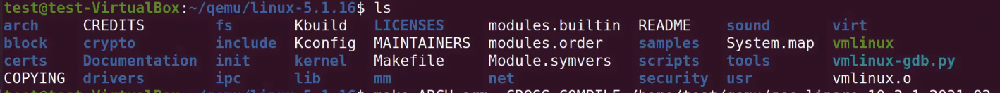
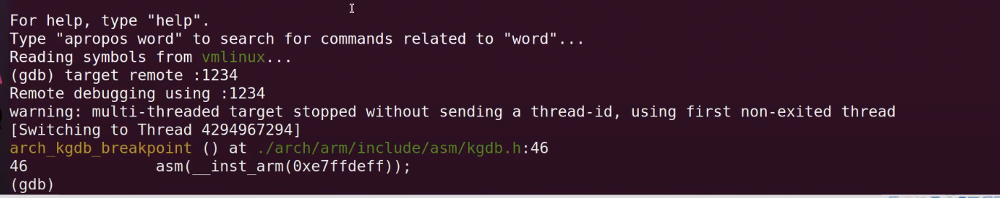

## GDB
**gdb basic usage**:
1. compile your code
- ```gcc -g yourcode.c -o output```  
- ```g++ -g3 gdb_demo.cpp -o demo```
- ```./output```  
2. Load the execuatble into GDB
- ```gdb ./your_project.exe```
**use ```control + x + a```**  
3. breakpoints
- (gdb) ```break foo.cpp:25```
- (gdb)``` break main()```
- (gdb)``` break 25```
- (gdb)``` break MyClass::bar```
4. run the executable
- (gdb)``` run```
- (gdb)``` run --arg 0.3 > output```
- (gdb)``` r 0.3 > output```
5. inspect
- (gdb) ```bt```
- (gdb) ```p my_var```
- (gdb) ```list```
- (gdb) ```next```
- (gdb) ```continue```

**gdb basic usage in debugging kernel**:
1. compile your code
2. complile your own kernel  
- make sure you have a ```vmlinux``` file (all the kernel info we need, like the debug info)
3. enable certain feature in your kernel config
- ```CONFIG_GDB_SCRIPTS```
4. ```sudo gdb vmlinux /proc/kcore```

GDB stops your kernel at certain point: break


**gdb commands**:
- ```b```(set breakpoint)
    - ```b main()```
    - ```b main.cpp:12```
    - ```b MyClass::~MyClass()```
- ```dis n```(disable breakpoint)
    - ```dis 1```(`1` is breakpoint number)
- ``` en n```(enable breakpoint)
- ```del n```(delete breakpoint)
- ```r args``` (run or restart)
    ```r --num_cpus 4```
- ```kill ```
- ```s```(step into a function)
- ```s n```(step n times)
- ```n n```(next n times, stepover functions)
- ```c```(continue until next breakpoint)
- ```p expr```(print)
- ```i topic``` (info)
    - ```i b ```(list breakpoints)
    - ```i thr```(list threads)
- ``` f```(frame)
    - view current line
- ```list```(list code)
    - view nearby code lines
- ```bt``` (view the call stack)
- ```up n```(up n frames,less recent)
- ```down n```(down n frames,more recent)
- ```thr n```(switch to thread)
- ```cond n expr```(conditional breakpoints)
    - ```cond 1 (i>=4)```
- Automatic breakpoint commands, Allow you to perform specific actions every time a breakpoint is hit.
    - ```
    (gdb) $ break main.cpp:44
    (gdb) $ commands
    > backtrace
    > print var
    > end

    ```

- ```help```
- ```lay next```(read assembly)
- ```break 6```(add breakpoint in the 6th line)
- ``` run ```
- ```refresh```
- ```info```(get info from specific area of the kernel)
- hit ```tab``` twice, it will return all the matching commands  
- (cheatsheet)[http://users.ece.utexas.edu/~adnan/gdb-refcard.pdf]
- (user manual)[https://sourceware.org/gdb/current/onlinedocs/gdb.html/]
- man gdb

**Example:**  
debugging memory map minimum addr  
- (gdb)```info address mmap_min_addr```  : Symbol "mmap_min_addr"  is static storage at address 0xfffffff82df6288
- (gdb)```print /x mmap_min_addr```  : $1 = 0x0 (sercurity reason for kernel, it won't show the memory map)
- (gdb)```print /d mmap_min_addr```  : $2 = 0
- (in your linux evironment)```cat /proc/kallsyms | grep mmap_min_addr```: 
0000000 T mmap_min_adr_handler  
0000000 D mmap_min_addr  
0000000 t init_mmap_min_addr  
0000000 d __initcall_kmod_min_addr__252_53_init_mmap_min_addr0  
0000000 B mmap_min_addr  
- (gdb)```print /x fixed_percpu_data```  : $3 = {gs base = {0x0 <repeats 40 times>},stack_canary = 0x0} // we find something! the fixed_percpu_data get executed 40 times in kernel
- **(gdb)```lx -```**: almost everything you need for debugging! 
    - ```dmesg```
    - ```cmdline```
    - ```cpus``` info about cpus
    - ```symbols```
    - ```device-list-bus```
    - ```configdump```

# Core dumps
- snapshot of program's state,debug non-deterministic (i.e. hard to reproduce) bugs
- you can call gdb to load your coredumps  

**create core dumps**

```
ulimit -c unlimited   
./your_program.exe   
Segmentation fault (core dumped)
```
the generated coredumps appear in /var/lib/systemd/coredump/ as an lz4 compressed file  
to uncompress: ```unlz4 /var/lib/systemd/coredump/core.PROGRAM.lz4 OUTPUT-FILENAME```
**View core dumps in GDB by running**
- ```gdb ./your_program.exe -c core.12345``` (Usually named something like core or core.12345, where 12345 was the Process ID (PID) of the program you ran)


## Debugging programs with multiple processes
在大多数系统中，GDB 并不支持调试使用 fork 函数创建额外进程的程序。当程序分叉时，GDB 将继续调试父进程，而子进程将不受影响地运行。如果你在子进程执行的任何代码中设置了断点，那么子进程将收到一个 SIGTRAP 信号（除非它捕获了该信号），这将导致子进程终止。  

不过，如果你想调试子进程，有一个不太痛苦的解决方法。在子进程在分叉后执行的代码中调用睡眠。只在设置了特定环境变量或存在特定文件时才休眠可能会很有用，这样当你不想在子进程上运行 GDB 时就不会出现延迟。当子进程处于休眠状态时，使用 ps 程序获取其进程 ID。然后告诉 GDB（如果同时调试父进程，则调用新的 GDB）附加到子进程。从那时起，你就可以像调试其他进程一样调试子进程了。  

GDB provides support for debugging programs that create additional processes using the ```fork or vfork``` function.  


默认情况下，当程序分叉时，GDB 将继续调试父进程，而子进程将不受影响地运行。

如果你想跟踪子进程而不是父进程，请使用 ```set follow-fork-mode``` 命令。

1. ```set follow-fork-mode mode```
Set the debugger response to a program call of fork or vfork. A call to fork or vfork creates a new process. The mode can be:
- ```parent```
The original process is debugged after a fork. The child process runs unimpeded. This is the default.
- ```child```
The new process is debugged after a fork. The parent process runs unimpeded.
- ```ask```
The debugger will ask for one of the above choices.
2. ```show follow-fork-mode```
Display the current debugger response to a fork or vfork call.   

如果您要求调试子进程，并且 vfork 之后有执行，GDB 会执行新目标直到新目标中的第一个断点。如果你在原程序的main上设置了断点，那么子进程的main上也会设置断点。

当 vfork 生成子进程时，在执行调用完成之前，无法调试子进程或父进程。

如果在执行调用后向 GDB 发出运行命令，新目标进程将重新启动。要重启父进程，请使用以父进程可执行文件名作为参数的 file 命令。

可以使用 catch 命令让 GDB 在执行 fork、vfork 或 exec 调用时停止。


## KGDB
in ```~/qemu/linux5.1.16```:  

``` make menuconfig ARCH=arm CROSS_COMPILE = /home/test/qemu/gcc-linaro-10.2.1-2024.01-x86_64_arm_linux_gnueabinf/bin/arm-linux-geueabinf-``` set ```kernel hacking -> compile time checks and compiler options -> compile the kernel with debug info & provide GDB scripts for kernel debugging```
- ```kgdbwait```: stop kernel execution and enter the kernel debugger at the earliest opportunity
``` qemu-system-arm -M vexpress -a9 -m 512M -dtb linux-5.1.16/arch/arm/boot/dts/vexpress-v 2p-ca9.dtb -kernel linux-5.1.16/arch/arm/boot/zImage -initrd rootfs.img.gz -append "kgdbwait kgdboc=ttyAMA0,115200 root=/dev/ram rdinit=/linuxrc" -sqrial tcp::1234,server,nowait```  

-qemu-system-arm: This is the main command for QEMU that emulates ARM systems.
-M vexpress-a9: This option specifies the machine model. vexpress-a9 is a model of a Versatile Express board with a Cortex-A9 processor.
-m 512M: This option sets the amount of memory for the guest system. In this case, it’s set to 512 megabytes.
-dtb linux-5.1.16/arch/arm/boot/dts/vexpress-v2p-ca9.dtb: This option specifies the Flattened Device Tree blob file, which describes the hardware of the machine.
-kernel linux-5.1.16/arch/arm/boot/zImage: This option specifies the kernel image to boot.
-initrd rootfs.img.gz: This option specifies the initial RAM disk.
-append "kgdbwait kgdboc=ttyAMA0,115200 root=/dev/ram rdinit=/linuxrc": This option specifies the kernel command line. kgdbwait and kgdboc=ttyAMA0,115200 are for kernel debugging.
-serial tcp::1234,server,nowait: This option redirects the virtual serial port to a TCP socket.

in ```~/qemu/linux5.1.16```  ```../gcc-linaro-10.2.1-2024.01-x86_64_arm_linux_gnueabinf/bin/arm-linux-geueabinf/bin/arm-linux-gnueabinf-gdb vmlinx```:  
(gdb) target remote:1234: 

- ```info threads```
- ```lx - cmdline```
- ```lx - cpus```
- ```lx - dmesg```
- ```lx - version```
- ```lx - fdtdump```
- ```lx - lsmod``` loading module
- ```lx - symbols```
- ```lx - mounts```
- ```lx - ps``` processes