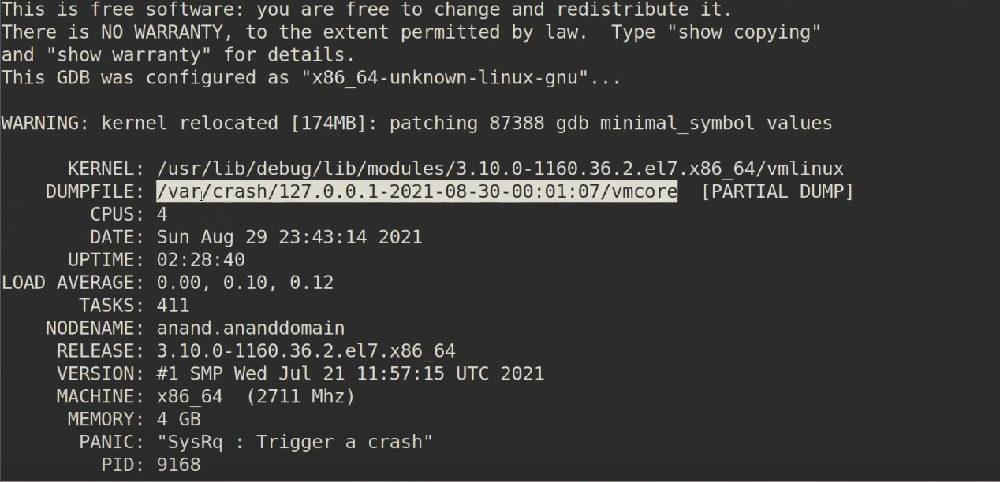

**A Kernel Crash Dump** is a portion of the contents of volatile memory(RAM) that is copied to disk whenever the execution of the kernel is disrupted:  
- kernel panic
- non maskable interrupts(NMI)
- machine check exceptions (MCE)
- hardware failure
- manual intervention

**kdump** is an utility used to capture the system core dump in the event of system crashes. These captured core dumps can be  used to analyze the exact casue of the system failure and implement the fix.  

kdump reserve a small portion of the memory for the secondary kernel called **crashkernel**. This crash kernel is used the capture the core dump image whenever the system crashes.  

The term "image" in this context refers to the memory dump of the system when it crashes. Here's how it works:

- **kdump** is a service that provides a crash dumping mechanism¹².
- When the system kernel crashes, kdump uses the **kexec** system call to boot into a second kernel, known as the **capture kernel** or **crashkernel**, without rebooting¹².
- This crashkernel then captures the contents of the crashed kernel's memory, also known as a **crash dump** or a **vmcore**, and saves it into a file¹².
- The crashkernel resides in a reserved part of the system memory¹². This reserved memory is not available to the main kernel¹.
- The memory requirements for the crashkernel vary based on certain system parameters, such as the system's hardware architecture and the total amount of installed system memory¹.

This mechanism ensures that the system's state at the time of the crash is preserved, which can be crucial for diagnosing the cause of the crash¹². The memory dump can be analyzed using various tools².

##  How to use Kdump 
1. kexec-tool package ```yum install kexex-tools```

2. set crashkernel in grub.conf(set ```crashkernel = auto```), set ```vi /boot/grub/grub.conf``` file and set the amount of memory(128M for 2G machine) to be reserved for the kdump crash kernel.edit: ```vi /etc/default/grub``` then ```cat /proc/cmdline``` will print the info of BOOT_IMAGE.   

3. configure core collector: comprass the data captured and filter all the unnecessary information from the captured core file. enable the core collector: ```core_collector makedumpfile -c --message-level 1 -d 31 ```  
**makedumpfile** makes a samll DUMPFILE by comprassing the data, it provides two DUMPFILE formats(ELF format & kdump-compressed format).   
- The kdump-compressed format can be read only with the crash utility and it can be smaller than the ELF format because of the compression support.
- The ELF format is readable with GDB and the crash utility. -c is to compress dump data by each page. -d is the number of paged that can be ignored.

4. restart kdump services: once kdump is configured, restart the kdump services. ``` systemctl enable kdump.service``` or start the service in the current session``` systemctl start kdump.service``` 

5. testing kdump(manually trigger kdump): reboot the system with kdump enabled and then ``` systemctl is-active kdump``` active

6. mannualy triger the core dump: ```echo 1 > /proc/sys/kernel/sysrq``` ```echo c > /proc/sysrq-trigger``` the server will reboot itself and the crash dump wll be generated. [magic system request key](https://www.kernel.org/doc/html/latest/admin-guide/sysrq.html)

7. view the core files ```cd /var/crash``` cd into this you can see:```vmcore``` and ``` vmcore-dmesg.txt```

8. kdump analysis using crash: crash utility is used to analyze the core file captured by kdump. It can also be used to analyze the core files created by other dump utilities like ```netdump diskdump xendump```. you need to ensuere the ```kernel-debuginfo``` package is present and is at the same level as the kernel.

9.launch the crash tool: ```crash /var/crash/...../vmcore /usr/lib/debu/lib/modules/`uname-r`/vmlinux```
then : crash>

- **troubleshooting**: ```sysctl kernel.panic``` kernel.panic = 5 ```vi /etc/sysctl.conf``` add kernel.panic = 5 to this config file

- view the process when system crashed:``` crash> ps```
- view swap space when systen crashed(display the swap space usage when the system crashed): ``` crash> swap```
- view IPCS (displayed the shared memory usage when the system crashed) ```crash> ipcs```
- view IRQ: ```crash> irq```
- view the virtual memory when crashed```crash> vm``` 
- view open files when crashed: ```crash> files```
- view system info when crashed: ```crash> sys```
- ```vtop + 'address'``` translate a user or kernel virtual address to its physical address
- ```foreach``` display  data for multiple tasks in the system
- ```waitq``` display all the tasks queued on a wait queue
