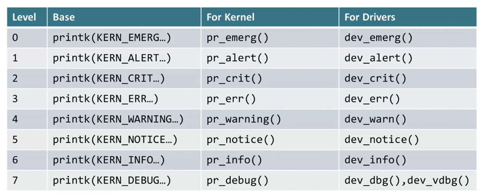

- Log buffer: store the kernel log messages
- Logging API: used by kernel module and device driver to generate log
- I/O Control API: user space application to control the log buffer and read the log messages from the buffer

- ```dmesg``` print the log buffer
- ```dmesg -C ``` clear the log buffer
- ```dmesg -c ``` print and clear the log buffer  

```/dev/kmsg```

# kernel log buffer size
- default 64KB
- adjust
    - -CONFIG_LOG_BUF_SHIFT=n
    - uboot bootargs:log_buf_len=n
    - buffer size = 2^n

# logging API
- printk() ```printk(KERN_ALERT "DBG:passed %s %d\n",__FUNCTION__,__LINE__)```
    - KERN_ALERT: message level   
    - ```dmesg -n 5``` or ```dmsg -l warn```
- ````pr_*()l`` are macros wrapping printk() for kernel module logging.
- ````dev_*()l`` are macros wrapping printk() for device driver logging.
- ```pr_debug()``` and ```dev_debug()``` only print when build a kernel with DEBUG or VERBOSE_DEBUG compiler macro is enabled
- locate kconfig option 
    - ./drivers/gpio/makefile
    - ```find . -name Kconfig -exec grep -Hn '\<config DEBUG_GPIO\>' {} |``` ./drivers/gpio/Kconfig:63:config DEBUG_GPIO

# dynamic debug
dynamically enable/disable kernel debug code at runtime to obtain kernel log:
- pr_debug()/dev_debug()
- print_hex_dump_debug()/print_hex_dump_bytes()
**control interface**
```mount -t debugfs non /sys/kernel/debug```
```cd /sys/kernel/debug/dynamic_debug/```
```echo "file xxx.c +p" > control``` turn on log for all in this file
```echo "file svcsock.c line 1603 +p" >control``` turn on the log in line 1603 in svcsock.c
```echo "file drivers/usb/core/* +p" > control```turn on log for all in this dir
```echo "file xxx.c -p" > control``` turn off logs  

``` echo "<matches> <ops><flags>" <debugfs>/dynamic_debug/control```
- matches
    - files
    - func
    - line (line range)
    - module
- ops
    - - remove the given flags
    - + add
    - = set
- flags
    - p print the log msg
    - f include the function name
    - l include the line number
    - m include the module name
    - t include the thread ID
    - _ no flags

# enable dug msgs during boot process
This allows debugging of the core or built-in modules during the boot process

- ``` dyndbg="QUERY"``` for kernel ```dyndbg="file ec.c +p"```
- ``` module.dyndbg="QUERY"``` for module

# Example
debug USB xHCI
- ```echo 'module xhci_hcd = p' > /sys/kernel/debug/dynamic_debug/control```
- plug in USB
- ```dmesg```

# kernel oops
deviation from correct behavior of the kernel. produce certain error messages in kernel log.

- error summary
- error type
- CPU#/PID#/Kernel version
- hardware
- CPU register dump
- stack dump
- backtrace  

# Example
1.   
```gdb vmlinux```  
(gdb)list *(cppi41_dma_probe+0x2c4)

2.   
the c is not in the kernel image but in the module  
```gdb drivers/usb/musb/musb_am335x.ko```  
(gdb)list*(am335x_child_probe+0x2c)

3. 


4. **L3 custom error**  
- caused by accessing clock-gated module
    - improper dts change
    - driver bug mainly runtime PM
- causing by wrong access
    - incorrect hardware design
    - drievr bug   
  
- L3 custom error caused in AES module
- it happens when CPU tries to read AES registers

5. **Spinlock dead lock**
  

## kernel features
1. trace events
- ```TRACE_EVENT(name,proto,args,struct,assign,print)```
- tracepoints event system
- debug interface
- 

2. dynamic probes
- ```kprobes``` software breakpoint
- CONFIG_KPROBES

3. perf events
- api for performance measurements
- CONFIG_PERF_EVENTS
- Hardware events
    - special registeration on most mordern CPUs
    - Limited number, round robin when needed
    - cycles, cache misses,branch hits
- Software events
    - context switches,page faults