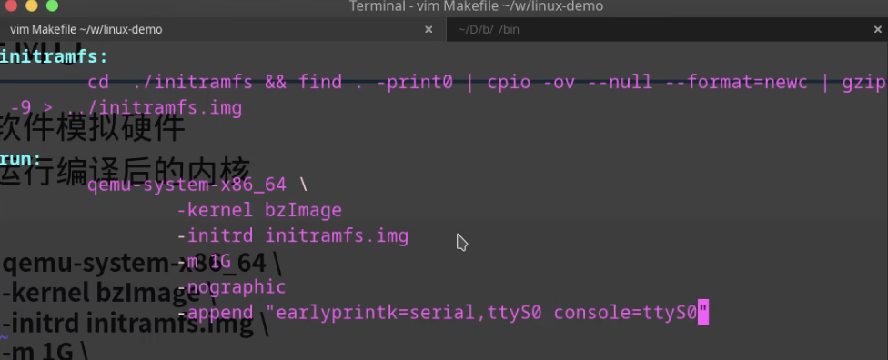

Application **Kernel** Hardware  
- interfaces
- resource manager  

## 计算机的启动过程
1. 主板加电
2. CPU reset
3. BIOS/UEFI
4. Bootloader
    - 解压kernel image bzImage
    - 把kernel 加载进内存
    - 把initramfs 加载进内存
        - init RAM filesystem
        - gzip 压缩的cpio包
        - create
            - cpio 打包
            - gzip 压缩cpio包
        - use
            - 在系统引导时，cpio包会被解压，里面的文件会被load进内存
            - filesystem在使用前必须被挂载
    - initramfs生成方式
        - cpio&&gzip ```ls | cpio -ov -H newc | gzip >./initramfs.img```
        - dracut 生成的文件为```initrd```(实际上为initramfs)
        - compile 进kernel （如果kernel中initramfs和外部的initramfs都存在，则外部的会覆盖kernel中的）
    - 拆解真实的initramfs
        - 目标：加载真实的root filesystem。将kernel不方便做的事情放到用户态（init进程）多个文件打包
        - ```/boot/initramfs.img```本质：经过gzip压缩的cpio包
        - 拆解
            - 解压
                - ``` mv initramfs.img initramfs.img.gz```
                - gunzip initramfs.img.gz
            - 解包
                 - ```mkdir -p initramfs```
                 - ```cpio -i -D initramfs < initramfs.img```
            - init
                - modprob 挂载module
                - ···switch_root?new_root/sbin/init切换到真实的rootfs


5. Kernel
    - mount ramfs/tmpfs (file system in kernel)
        - 源码实现 ```fs/ramfs/inode.c```
        - 查看注册的filesystem ```cat/proc/filesystems | grep ramfs```
        - ramdisk/ramfs/tmpfs/rootfs
            - ramdisk
                - 内存上划出一块区域 /dev/initrd
                - 块设备是固定大小的
                - 需要用filesystem识别data-> kernel中要有对应driver
            - ramfs
                - 在内存上挂载文件系统
            - tmpfs
                - ramfs升级版
                - 可以使用交换空间，内存满的时候可以正常运行
            - rootfs
                - ramfs tmpfs的一个实例
                - 区别于/root,是root/home
    - 解压initramfs 到rootfs
    - 找到init程序，将控制权转移给init

6. init 进程完成其他事情，并挂载真实的roofs


## Modules
- process scheduling switch, cpu time slicing for multiple processes，priority
- Memory（RAM） management： processes have their own resource
- Virtual memory
- network
- device driver
- Process communication and locks  
IPC
    - pipes
    - shared memory
    - signal  
- page table
- data synchronization
    - buffer to disk  
## Compile
- Compile Kernel
    - make menuconfig/make mrproper(default config)
    - make -j15
- Compile busybox
    - make menuconfig
    - make -j15
- make initramfs
    - initramfs: 第一个process init存储在root filesystem/storage filesystem。busy box打包为cpio，直接编译进kernel
    - busybox
    模拟filesystem
        - ```find . -print0|cpio --null -ov --format=newc|gzip -9 > ../build/initramfs.cpio.gz``` find 查找文件cpio打包 null不使用文件名 o创建 v输出详细信息 format打包格式 gzip压缩

- start QEMU
软件模拟硬件，运行编译后的内核
    - qemu-system-x86_64  
    - exit ```Ctrl+a then +x```


- view ```linux/initramfs_dir/init```:
```
#!/bin/busybox sh

/bin/busybox mkdir -p /proc && /bin/busybox mount -t proc non /proc
/bin/busybox echo "Hello Linux"

export PS1 = '(kernel) =>'
/bin/busybox sh

```
- (in linux dir) ```make initramps``` ```make run```
**DEBUG**
- bzImage(x86_64)
- ```CONFIG_DEBUG_INFO```
- vmlinux & system.map

**Inter-process communication (IPC)** is a mechanism that allows processes to communicate with each other and synchronize their actions¹². The communication between these processes can be seen as a method of cooperation between them¹. Processes can communicate with each other through both shared memory and message passing¹.

In the context of locks, IPC is crucial. For instance, when using shared storage, a producer should gain an exclusive lock on the file before writing to it³. An exclusive lock can be held by one process at most, which rules out a race condition because no other process can access the file until the lock is released³. A consumer should gain at least a shared lock on the file before reading from it³.

Here are some common methods of IPC:

1. **Shared Memory**: Communication between processes using shared memory requires processes to share some variable¹. It completely depends on how the programmer will implement it¹.

2. **Message Passing**: This involves sending and receiving messages between processes¹.

3. **Semaphores**: Semaphores are a common method of interprocess communication². They are used for programs to communicate data to each other and to synchronize their activities².

4. **Message Queues**: Internal message queues are another common method of interprocess communication².

Remember, IPC is a method for two or more separate programs or processes to communicate with each other². This avoids using real disk-based files and the associated I/O overhead to pass information². Like a file, you must first create or open the resource, use it, and close it². Unlike real disk-based files, semaphores, message queues, and shared memory do not persist across reboots².
