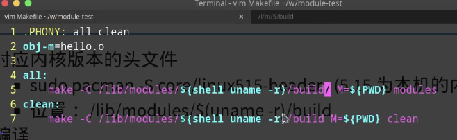
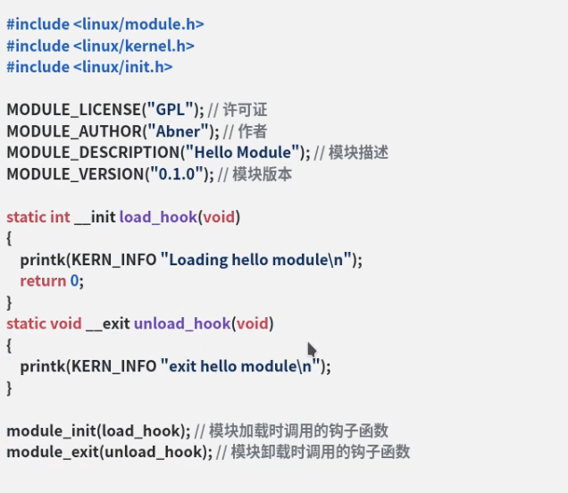

1. lsmod 
- show module stats
- cat /proc/modules
- lsmod | grep xxx
2. insmod/rmmod 插入/卸载module
3. modprobe xxx
- 添加module到kernel
- 删除module(modeprobe -r)
4. modinfo
5. depmod 生成modules.dep文件，描述module之间依赖关系

# 如何编写module文件
1. 对应kernel version的head file
- ```sudo pacman -S core/linux515-headers```
- ```/lib/modules/$(uname -r)/build```
- makefile 

2. make
3. 加载 ```sudo insmod hello.ko```
4. 查看
    - ```lsmod|grep hello```
    - ```modinfo hello.ko```
    - ```sudo dmesg |grep hello```
5. 卸载
    - ``` sudo rmmod hello```
6. implement
