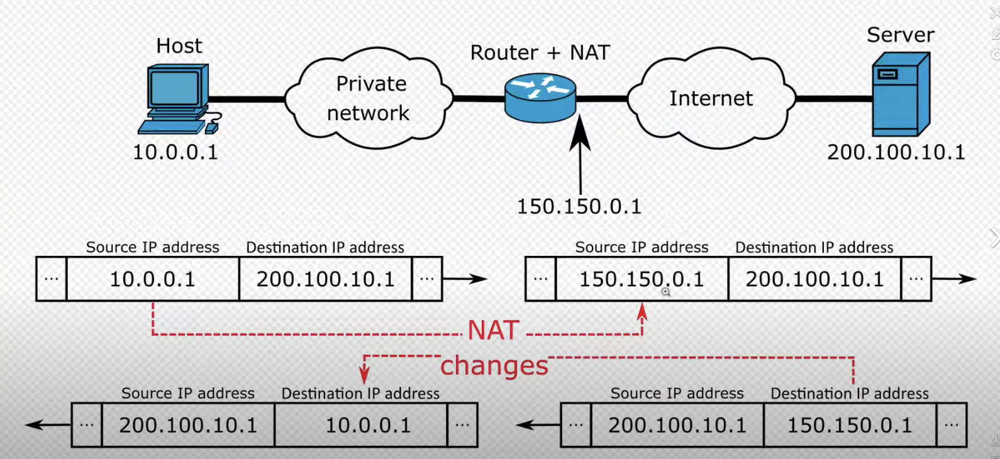
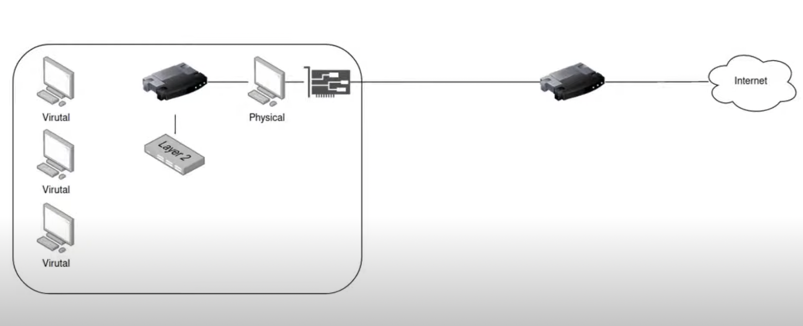

### KVM
Kernel-based Virtual Machine
- virtualization 
- turn Linux into a hypervisor that allows a host machine to run multiple isolated virtual environments called guests or virtual machines(VMs).

**hypervisor**: Linux machine -> Mac/Windows  

**goddside**: 
- backup & restore when install some tools on Linux
    - take a snapshot of the VM before running the install
    - revert if something goes wrong
- simplify tesing and bug fixing
    - clone a working VM into multiple environments 
**other hypervisor**:
- VirtualBox
- VMware
- Hyper-V  

<br></br>
``` egrep -c '(vmx|svm)' /proc/cpuinfo```  

``` sudo dnf install @virtualization```

1. qemu-kvm: the emulator itself
2. libvirt-daemon: runs virtualization in background
3. bridge-utils: important networking dependencies
4. virt-manager: the graphical program we'ill use to work with VMs.

## Internet connection of VM

How does Virt-Manager put NAT to use?  
After we install qemu kvm, we got two new vitual hardware devices: a virtual router and a virtual switch
- vitual network
    - default: its own virtual router 
    - its hosts(the virtual machine) gets their IPs from DHCP service in this virtual router 
- virtual switch
    - to be able to connect more virtual machines to the virtual router  (allows more devices in the same network/allows more virtual machines in the same virtual router)  


```ip addr``` or ```ifconfig```  // all network interface
output:  
```
lo0: flags=8049<UP,LOOPBACK,RUNNING,MULTICAST> mtu 16384
	options=1203<RXCSUM,TXCSUM,TXSTATUS,SW_TIMESTAMP>
	inet 127.0.0.1 netmask 0xff000000 
	inet6 ::1 prefixlen 128 
	inet6 fe80::1%lo0 prefixlen 64 scopeid 0x1 
	nd6 options=201<PERFORMNUD,DAD>
gif0: flags=8010<POINTOPOINT,MULTICAST> mtu 1280
stf0: flags=0<> mtu 1280
anpi1: flags=8863<UP,BROADCAST,SMART,RUNNING,SIMPLEX,MULTICAST> mtu 1500
	options=400<CHANNEL_IO>
	ether 26:a8:f6:93:4f:94 
	inet6 fe80::24a8:f6ff:fe93:4f94%anpi1 prefixlen 64 scopeid 0x4 
	nd6 options=201<PERFORMNUD,DAD>
	media: none
	status: inactive
anpi0: flags=8863<UP,BROADCAST,SMART,RUNNING,SIMPLEX,MULTICAST> mtu 1500
	options=400<CHANNEL_IO>
	ether 26:a8:f6:93:4f:93 
	inet6 fe80::24a8:f6ff:fe93:4f93%anpi0 prefixlen 64 scopeid 0x5 
	nd6 options=201<PERFORMNUD,DAD>
	media: none
	status: inactive
anpi2: flags=8863<UP,BROADCAST,SMART,RUNNING,SIMPLEX,MULTICAST> mtu 1500
	options=400<CHANNEL_IO>
	ether 26:a8:f6:93:4f:95 
	inet6 fe80::24a8:f6ff:fe93:4f95%anpi2 prefixlen 64 scopeid 0x6 
	nd6 options=201<PERFORMNUD,DAD>
	media: none
	status: inactive
en4: flags=8863<UP,BROADCAST,SMART,RUNNING,SIMPLEX,MULTICAST> mtu 1500
	options=400<CHANNEL_IO>
	ether 26:a8:f6:93:4f:73 
	nd6 options=201<PERFORMNUD,DAD>
	media: none
	status: inactive
en5: flags=8863<UP,BROADCAST,SMART,RUNNING,SIMPLEX,MULTICAST> mtu 1500
	options=400<CHANNEL_IO>
	ether 26:a8:f6:93:4f:74 
	nd6 options=201<PERFORMNUD,DAD>
	media: none
	status: inactive
en6: flags=8863<UP,BROADCAST,SMART,RUNNING,SIMPLEX,MULTICAST> mtu 1500
	options=400<CHANNEL_IO>
	ether 26:a8:f6:93:4f:75 
	nd6 options=201<PERFORMNUD,DAD>
	media: none
	status: inactive
en1: flags=8963<UP,BROADCAST,SMART,RUNNING,PROMISC,SIMPLEX,MULTICAST> mtu 1500
	options=460<TSO4,TSO6,CHANNEL_IO>
	ether 36:6d:a8:40:96:40 
	media: autoselect <full-duplex>
	status: inactive
en2: flags=8963<UP,BROADCAST,SMART,RUNNING,PROMISC,SIMPLEX,MULTICAST> mtu 1500
	options=460<TSO4,TSO6,CHANNEL_IO>
	ether 36:6d:a8:40:96:44 
	media: autoselect <full-duplex>
	status: inactive
en3: flags=8963<UP,BROADCAST,SMART,RUNNING,PROMISC,SIMPLEX,MULTICAST> mtu 1500
	options=460<TSO4,TSO6,CHANNEL_IO>
	ether 36:6d:a8:40:96:48 
	media: autoselect <full-duplex>
	status: inactive
ap1: flags=8843<UP,BROADCAST,RUNNING,SIMPLEX,MULTICAST> mtu 1500
	options=400<CHANNEL_IO>
	ether ea:89:f3:be:b0:dd 
	nd6 options=201<PERFORMNUD,DAD>
	media: autoselect
	status: inactive
en0: flags=8863<UP,BROADCAST,SMART,RUNNING,SIMPLEX,MULTICAST> mtu 1500
	options=6463<RXCSUM,TXCSUM,TSO4,TSO6,CHANNEL_IO,PARTIAL_CSUM,ZEROINVERT_CSUM>
	ether c8:89:f3:be:b0:dd 
	inet6 fe80::10cd:d4c5:92bf:bc67%en0 prefixlen 64 secured scopeid 0xe 
	inet 100.64.8.157 netmask 0xfffff000 broadcast 100.64.15.255
	nd6 options=201<PERFORMNUD,DAD>
	media: autoselect
	status: active
awdl0: flags=8943<UP,BROADCAST,RUNNING,PROMISC,SIMPLEX,MULTICAST> mtu 1500
	options=400<CHANNEL_IO>
	ether e6:e5:1b:c2:e1:98 
	inet6 fe80::e4e5:1bff:fec2:e198%awdl0 prefixlen 64 scopeid 0xf 
	nd6 options=201<PERFORMNUD,DAD>
	media: autoselect
	status: active
llw0: flags=8863<UP,BROADCAST,SMART,RUNNING,SIMPLEX,MULTICAST> mtu 1500
	options=400<CHANNEL_IO>
	ether e6:e5:1b:c2:e1:98 
	inet6 fe80::e4e5:1bff:fec2:e198%llw0 prefixlen 64 scopeid 0x10 
	nd6 options=201<PERFORMNUD,DAD>
	media: autoselect
	status: active
bridge0: flags=8863<UP,BROADCAST,SMART,RUNNING,SIMPLEX,MULTICAST> mtu 1500
	options=63<RXCSUM,TXCSUM,TSO4,TSO6>
	ether 36:6d:a8:40:96:40 
	Configuration:
		id 0:0:0:0:0:0 priority 0 hellotime 0 fwddelay 0
		maxage 0 holdcnt 0 proto stp maxaddr 100 timeout 1200
		root id 0:0:0:0:0:0 priority 0 ifcost 0 port 0
		ipfilter disabled flags 0x0
	member: en1 flags=3<LEARNING,DISCOVER>
	        ifmaxaddr 0 port 10 priority 0 path cost 0
	member: en2 flags=3<LEARNING,DISCOVER>
	        ifmaxaddr 0 port 11 priority 0 path cost 0
	member: en3 flags=3<LEARNING,DISCOVER>
	        ifmaxaddr 0 port 12 priority 0 path cost 0
	nd6 options=201<PERFORMNUD,DAD>
	media: <unknown type>
	status: inactive
utun0: flags=8051<UP,POINTOPOINT,RUNNING,MULTICAST> mtu 1380
	inet6 fe80::3bb:1ec3:257a:16dd%utun0 prefixlen 64 scopeid 0x12 
	nd6 options=201<PERFORMNUD,DAD>
utun1: flags=8051<UP,POINTOPOINT,RUNNING,MULTICAST> mtu 2000
	inet6 fe80::a3ed:384c:3d97:c937%utun1 prefixlen 64 scopeid 0x13 
	nd6 options=201<PERFORMNUD,DAD>
utun2: flags=8051<UP,POINTOPOINT,RUNNING,MULTICAST> mtu 1000
	inet6 fe80::ce81:b1c:bd2c:69e%utun2 prefixlen 64 scopeid 0x14 
	nd6 options=201<PERFORMNUD,DAD>
utun4: flags=8051<UP,POINTOPOINT,RUNNING,MULTICAST> mtu 1380
	inet6 fe80::81d5:ad41:c909:1d39%utun4 prefixlen 64 scopeid 0x18 
	nd6 options=201<PERFORMNUD,DAD>
utun5: flags=8051<UP,POINTOPOINT,RUNNING,MULTICAST> mtu 1380
	inet6 fe80::f96e:800d:e8cd:6374%utun5 prefixlen 64 scopeid 0x19 
	nd6 options=201<PERFORMNUD,DAD>
utun6: flags=8051<UP,POINTOPOINT,RUNNING,MULTICAST> mtu 1380
	inet6 fe80::510a:a250:e87:df03%utun6 prefixlen 64 scopeid 0x1a 
	nd6 options=201<PERFORMNUD,DAD>
utun7: flags=8051<UP,POINTOPOINT,RUNNING,MULTICAST> mtu 1380
	inet6 fe80::532f:4cd6:8c2e:9be8%utun7 prefixlen 64 scopeid 0x1b 
	nd6 options=201<PERFORMNUD,DAD>
vmenet0: flags=8b63<UP,BROADCAST,SMART,RUNNING,PROMISC,ALLMULTI,SIMPLEX,MULTICAST> mtu 1500
	ether 72:a2:89:6f:66:d2 
	media: autoselect
	status: active
bridge100: flags=8a63<UP,BROADCAST,SMART,RUNNING,ALLMULTI,SIMPLEX,MULTICAST> mtu 1500
	options=3<RXCSUM,TXCSUM>
	ether ca:89:f3:eb:d6:64 
	inet 192.168.64.1 netmask 0xffffff00 broadcast 192.168.64.255
	inet6 fe80::c889:f3ff:feeb:d664%bridge100 prefixlen 64 scopeid 0x17 
	inet6 fd46:90d7:c483:1fe2:10a7:b8b9:c33a:f29b prefixlen 64 autoconf secured 
	Configuration:
		id 0:0:0:0:0:0 priority 0 hellotime 0 fwddelay 0
		maxage 0 holdcnt 0 proto stp maxaddr 100 timeout 1200
		root id 0:0:0:0:0:0 priority 0 ifcost 0 port 0
		ipfilter disabled flags 0x0
	member: vmenet0 flags=3<LEARNING,DISCOVER>
	        ifmaxaddr 0 port 22 priority 0 path cost 0
	nd6 options=201<PERFORMNUD,DAD>
	media: autoselect
	status: active
```

**virbr0**: virtual bridge(virtual switch)
- virbr0-nic: the bridge at least has one network device
    - bridge itself has an ip within the range of virtual router DHCP 
- each running virtual machine wil add one vnet entry

# Difference between NET and Bridge network
- bridge network doesn't use a virtual router, create a new switch and attach a physical nic as a slave to the switch.
- get their iP from physical router
